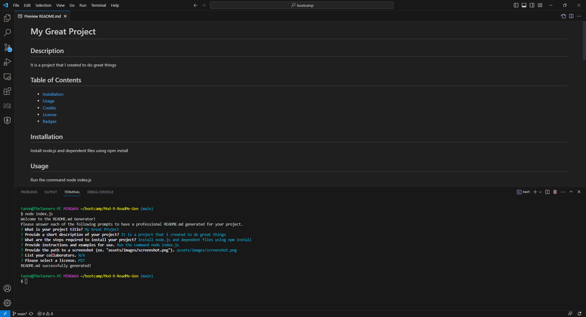

# Mod-9-ReadMe-Gen

## Description

A node.js application that generates a professional README.md file. It is designed to help developers easily generate the file for their given project. It creates an automated way to generate the markdown text for the file in a professional way. 

## Installation

Project has a dependency on the inquirer library and the user must run npm install to include the needed library.  Additionally, node.js must be installed.

## Usage

Run node index.js from the installed folder. The following image shows the application's appearance and functionality:

## Credits

N/A

## License

N/A
